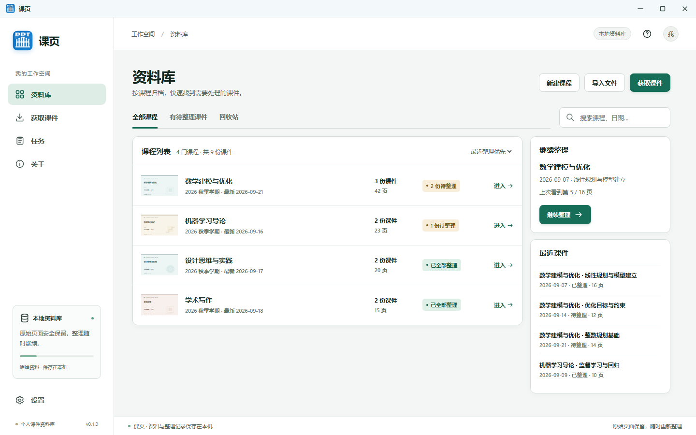
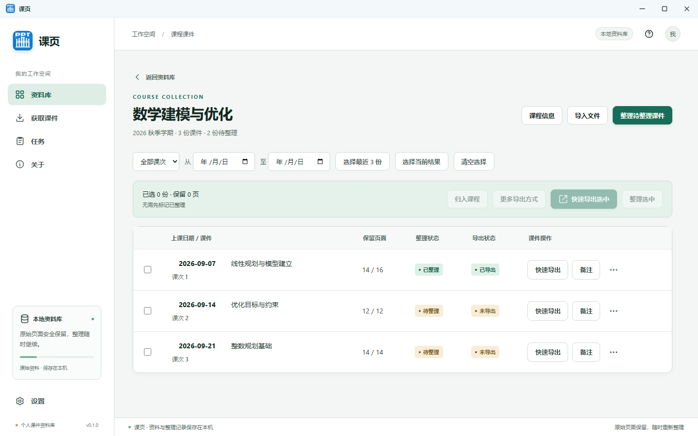
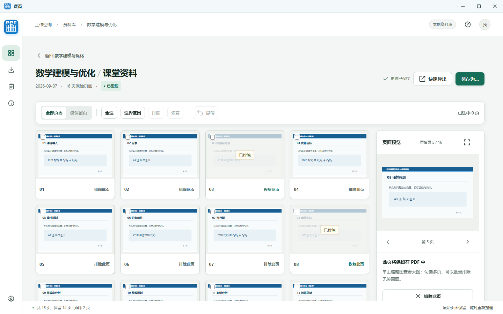

<p align="center"></p>

<h1 align="center">课页 · Keye</h1>

<p align="center"><strong>华南理工大学课堂 PPT 下载器</strong></p>

<p align="center">按课表扫描课堂课件，集中下载、逐页筛选并导出 PDF。</p>

<p align="center">
  <a href="https://github.com/goooseby/keye-desktop/releases/latest"></a>
  <a href="https://github.com/goooseby/keye-desktop/releases"></a>
  
  
  
  
</p>

<p align="center"><a href="https://github.com/goooseby/keye-desktop/releases/latest"><strong>下载 Windows 安装包</strong></a>　·　<a href="docs/DEVELOPMENT.md">从源码运行</a>　·　<a href="docs/DISTRIBUTION.md">安装与数据说明</a></p>

---

课页是一款面向华南理工大学的 Windows 课堂 PPT 下载与整理工具。选择日期范围后，程序会自动读取课表并按课程、课次列出课堂平台中的课件；凡是在教室内按课表授课、且平台已经生成的课堂 PPT，都可以集中下载，无需逐门课程手工查找。

下载后的课件会自动归入本地课程资料库。你可以直接导出 PDF，也可以逐页预览并排除自动采集过程中产生的无关画面；原始页面始终保留，之后还能继续调整。程序也支持导入已有图片和 PDF。

## 核心特点

- **按课表自动获取**：登录学校课堂平台后，选择日期范围即可扫描对应课程；修改日期会自动重新扫描，也可以手动强制刷新。
- **按课程和课次收纳**：同一门课程的多次课堂课件集中管理，避免下载后散落成大量无序文件。
- **下载后即可导出**：整理不是前置条件，可以快速生成 PDF，也可以先筛除无关页面再导出。
- **资料保存在本机**：原始页面、整理记录和导出设置均由本地资料库保存。

## 界面预览

下列截图使用示例课程和示例页面，不包含真实账号或课件内容。

**资料库** · 课程、待整理数量和最近课件集中在一个页面。



**课程课次** · 按上课日期查看课件，支持单份快速导出与批量操作。



**逐页整理** · 同时查看缩略图和大图，排除、恢复或批量选择页面。



## 可以做什么

- **获取课程资料**：在独立窗口登录学校平台，选择日期范围后自动扫描华南理工大学课表；下载任务按课件分别显示。
- **导入已有文件**：导入图片、PDF 或课件目录，按课程和课次整理。
- **筛选页面**：浏览缩略图与大图，使用 `E` 排除或恢复当前页、方向键翻页、`Shift` 连选，并可撤销操作。
- **灵活导出**：无需先标记“已整理”，就能快速导出单份或多份课件；首次导出时选择保存目录。
- **保留自己的资料**：课程、原始页面和整理记录存于本地，升级程序不会清空资料库。

## 安装与更新

从 [GitHub Releases](https://github.com/goooseby/keye-desktop/releases/latest) 下载 `Keye_*_x64-setup.exe`，运行安装向导即可选择安装位置。课页使用 Windows 当前用户的数据目录保存资料；程序安装目录不存放课件。卸载可从 Windows“已安装的应用”或程序“关于”页启动，卸载向导允许选择保留或删除默认应用数据。自己另选的资料库目录和已经导出的 PDF 不会由卸载器删除。

“关于”页提供应用内更新：检查 GitHub Release、下载签名更新包并安装。当前采用完整安装包更新，操作无需手动替换文件；未来若加入差分下载，也会保留完整包作为后备。更多细节见 [Windows 分发说明](docs/DISTRIBUTION.md)。

## 开发

桌面端基于 **Tauri 2 + Rust + TypeScript + 系统 WebView2**。Windows 开发环境和项目内工具链说明见 [开发环境文档](docs/DEVELOPMENT.md)。工具齐备后，在仓库目录运行：

```powershell
npm ci
powershell -NoProfile -ExecutionPolicy Bypass -File .\scripts\dev.ps1
```

开发资料保存在项目内 `.build/dev-data/`，与安装版的用户资料分开。浏览器直接打开前端页面无法调用桌面功能。

项目结构与行为约定另见 [产品需求](docs/REQUIREMENTS.md)、[架构说明](docs/ARCHITECTURE.md)和[数据保护](docs/MIGRATION.md)。
